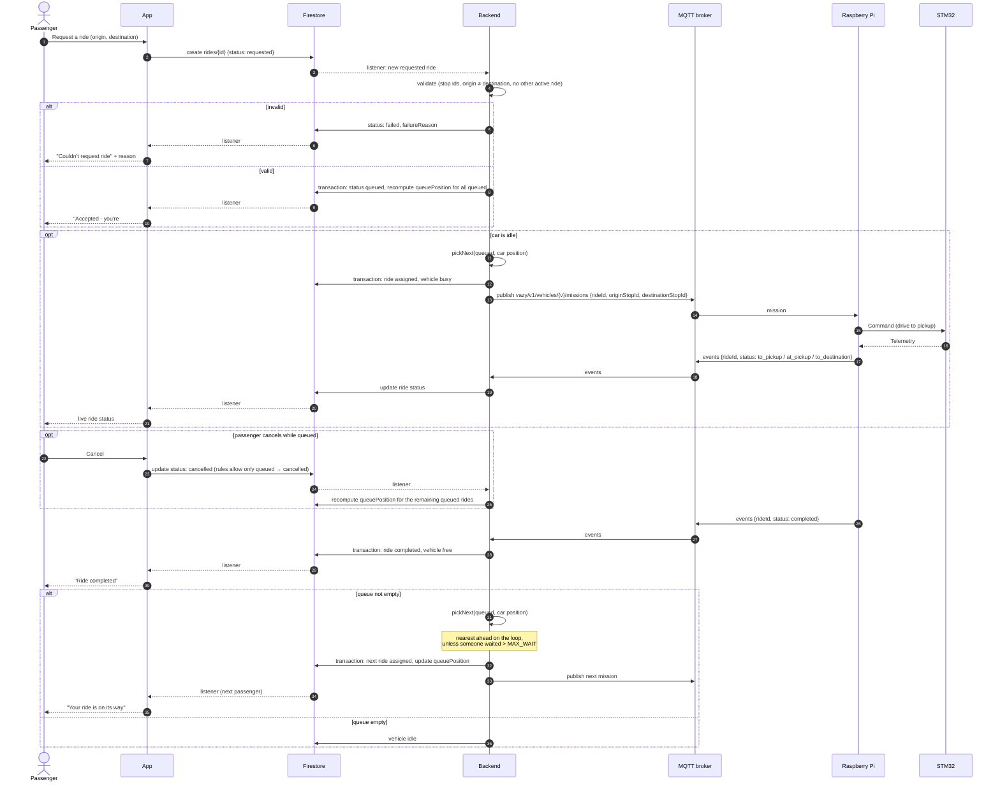

# Vazy ride sequence (1 vehicle)

Decisions and the dispatch rule: [.claude/plans/ride-dispatch.md](../.claude/plans/ride-dispatch.md) (local plan notes).

```mermaid
sequenceDiagram
    autonumber
    actor P as Passenger
    participant A as App
    participant F as Firestore
    participant B as Backend
    participant M as MQTT broker
    participant R as Raspberry Pi
    participant S as STM32

    P->>A: Request a ride (origin, destination)
    A->>F: create rides/{id} {status: requested}
    F-->>B: listener: new requested ride
    B->>B: validate (stop ids, origin ≠ destination, no other active ride)
    alt invalid
        B->>F: status: failed, failureReason
        F-->>A: listener
        A-->>P: "Couldn't request ride" + reason
    else valid
        B->>F: transaction: status queued, recompute queuePosition for all queued
        F-->>A: listener
        A-->>P: "Accepted - you're #N in line"
    end

    opt car is idle
        B->>B: pickNext(queued, car position)
        B->>F: transaction: ride assigned, vehicle busy
        B->>M: publish vazy/v1/vehicles/{v}/missions {rideId, originStopId, destinationStopId}
        M->>R: mission
        R->>S: Command (drive to pickup)
        S-->>R: Telemetry
        R->>M: events {rideId, status: to_pickup / at_pickup / to_destination}
        M->>B: events
        B->>F: update ride status
        F-->>A: listener
        A-->>P: live ride status
    end

    opt passenger cancels while queued
        P->>A: Cancel
        A->>F: update status: cancelled (rules allow only queued → cancelled)
        F-->>B: listener
        B->>F: recompute queuePosition for the remaining queued rides
    end

    R->>M: events {rideId, status: completed}
    M->>B: events
    B->>F: transaction: ride completed, vehicle free
    F-->>A: listener
    A-->>P: "Ride completed"
    alt queue not empty
        B->>B: pickNext(queued, car position)
        Note over B: nearest ahead on the loop,<br/>unless someone waited > MAX_WAIT
        B->>F: transaction: next ride assigned, update queuePosition
        B->>M: publish next mission
        F-->>A: listener (next passenger)
        A-->>P: "Your ride is on its way"
    else queue empty
        B->>F: vehicle idle
    end
```
